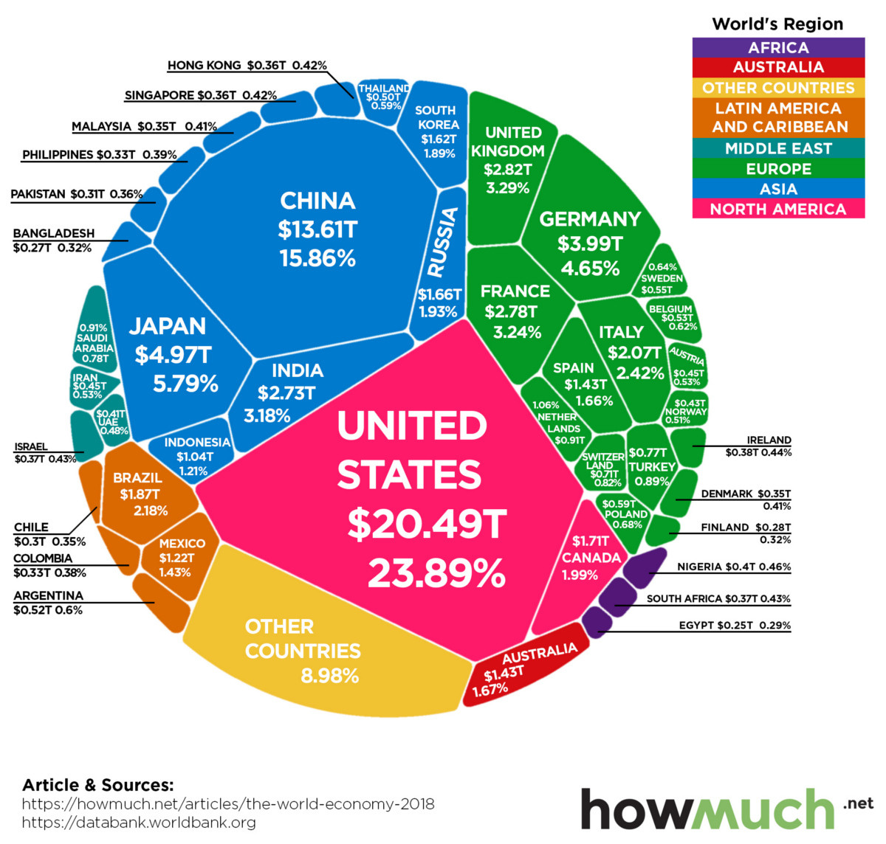
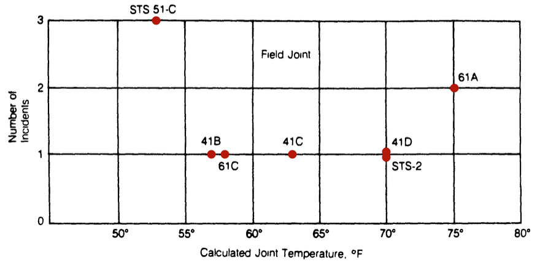
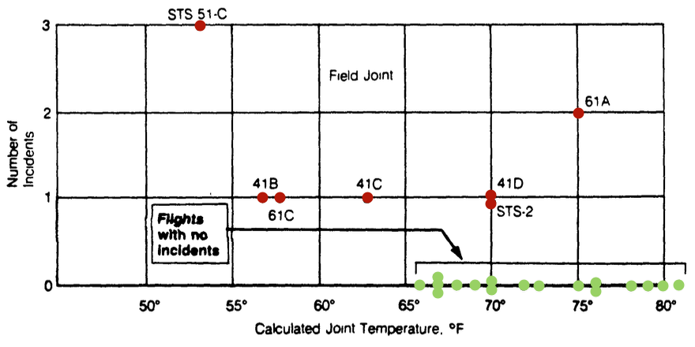

```{r, eval=TRUE, include=TRUE, echo=FALSE, message=FALSE, warning=FALSE}
# regarding `library()`: you don't have to `library(knitr)` if you `knitr::`
knitr::opts_chunk$set(eval=TRUE, include=TRUE, echo=TRUE, message=FALSE, warning=FALSE)

# knitting will default to pdf (rather than, e.g., html)
knitr::opts_chunk$set(dev='pdf')

# Defines a new code chunk `parameter=argument` option which will allow the
# size of printed code+output to be controlled using latex text size names:
# https://www.overleaf.com/learn/latex/Font_sizes%2C_families%2C_and_styles#Reference_guide
def.chunk.hook  <- knitr::knit_hooks$get("chunk")
knitr::knit_hooks$set(chunk = function(x, options) {
  x <- def.chunk.hook(x, options)
  ifelse(options$size != "normalsize", paste0("\n \\", options$size,"\n\n", x, "\n\n \\normalsize"), x)
})

color_block = function(color) {
  function(x, options) sprintf('\\color{%s}\\begin{verbatim}%s\\end{verbatim}',
                               color, x)
}
knitr::knit_hooks$set(message = color_block('red'))
knitr::knit_hooks$set(error = color_block('red'))
```

---

```{r, eval=FALSE, include=FALSE}
download.file(url = "https://jminnier-berd-r-courses.netlify.app/02-data-wrangling-tidyverse/img/horst_tidyverse.jpg",
              destfile = "images/horst_tidyverse.jpg", mode = 'wb')
```

\begin{minipage}{\textwidth}
\vspace{-.7cm}
\hspace{-1cm}\includegraphics[width=1.15\textwidth]{images/horst_tidyverse.jpg}
\end{minipage}

\begin{columns}
\begin{column}{.7\textwidth}
\huge \^{} Us / the plan 4 2-day
\end{column}
\begin{column}{.3\textwidth}
\Large \href{https://github.com/allisonhorst/stats-illustrations}{@Allison\_Horst}
\end{column}
\end{columns}

## Class Check Round 1

\Huge [https://pollev.com/sta](https://pollev.com/sta) (3 questions)


## Tidy Data


```{r, eval=FALSE, include=FALSE}
download.file(url = "https://github.com/allisonhorst/stats-illustrations/raw/master/rstats-artwork/tidydata_1.jpg",
              destfile = "images/tidydata_1.jpg", mode = 'wb')
download.file(url = "https://github.com/allisonhorst/stats-illustrations/raw/master/rstats-artwork/tidydata_2.jpg",
              destfile = "images/tidydata_2.jpg", mode = 'wb')
download.file(url = "https://github.com/allisonhorst/stats-illustrations/raw/master/rstats-artwork/tidydata_3.jpg",
             destfile = "images/tidydata_3.jpg", mode = 'wb')
download.file(url = "https://d33wubrfki0l68.cloudfront.net/6f1ddb544fc5c69a2478e444ab8112fb0eea23f8/91adc/images/tidy-1.png",
             destfile = "images/rowscolscells.png", mode = 'wb')
```

\emph{"Happy families are all alike; every unhappy family is unhappy in its own way."} -- Tolstoy 


\begin{columns}
\begin{column}{.69\textwidth}

\begin{block}{Standardized "Tidy Data" means much less work...}
\includegraphics[width=\textwidth]{images/tidydata_2.jpg}

\end{block}

\end{column}
\begin{column}{.3\textwidth}

\emph{"Write code for humans, but data for computers"}

-- Vince Buffalo, author of \href{https://vincebuffalo.com/book/}{Bioinformatics Data Skills}

$\;$

\emph{"It's often said that 80\% of data analysis is spent on the process of 
cleaning and preparing the data"}
 

-- Hadley Wickham, author of the \href{https://r4ds.had.co.nz/tidy-data.html}{R4DS} and \href{https://dplyr.tidyverse.org/}{\texttt{dplyr}}

\end{column}
\end{columns}

\vspace{-.33in}
\href{https://github.com/allisonhorst/stats-illustrations}{@Allison\_Horst}
\vspace{.33in}


## Tidy Data 

\vspace{0.15cm}

### "Tidy Data" really just means "'Easy for a Computer to Use' Data"

\begin{center}
\vspace{0.5in}
\includegraphics[width=.75\textwidth]{images/tidydata_1.jpg}

\vspace{-2.75in}
\includegraphics[width=.75\textwidth]{images/rowscolscells.png}
\end{center}

\vspace{1.5in}

\vspace{-.5in}
$\quad\quad\quad\quad\quad\quad\quad\quad$ \href{https://r4ds.had.co.nz/tidy-data.html\#fig:tidy-structure}{@R4DS} and \href{https://github.com/allisonhorst/stats-illustrations}{@Allison\_Horst}

\vspace{.5in}


## Quiz 1 on Tidy Data


```{r, eval=TRUE, include=TRUE, echo=FALSE, size="footnotesize"}
library(tibble) # `tibble`
library(tidyr) # `pivot_longer/wider`
marks <- tibble("Kim Nam Joon"=c(9.2,9.4,6,2.7,7.7,5.7,5.1),
                "Kim Seok Jin"=c(5.1,5,2.1,7.1,2.7,7.6,2.9),
                "Park Ji Min"=c(1.9,6,4.6,6.2,5,2.9,3),
                "Marks"=c("Mark1","Mark2","Mark3","Mark4","Mark5","Mark6","Mark7"))
```


\begin{block}{Which of these tables is organized in the "Tidy Data" format?}
Which most easily plots the distribution of grades for all of the students?
\end{block}

:::columns

::::column

```{r, eval=TRUE, include=TRUE, echo=FALSE, size="tiny"}
marks %>% 
  pivot_longer(names(marks)[1:3], names_to="Students", values_to="Mark") %>%
  pivot_wider(names_from = "Marks", values_from="Mark") 
```

\vspace{.15in}

```{r, eval=TRUE, include=TRUE, echo=FALSE, size="tiny"}
marks
```

::::

::::column

```{r, eval=TRUE, include=TRUE, echo=FALSE, size="scriptsize"}
tidy_marks <- marks %>% 
  pivot_longer(names(marks)[1:3], names_to="Students", values_to="Mark") 
tidy_marks #%>% print(n=5) # https://tibble.tidyverse.org/reference/formatting.html
```

::::
:::


## This should be easy with Tidy Data

###

```{r, eval=TRUE, include=FALSE}
library(ggplot2)
tidy_marks <- marks %>% 
  pivot_longer(names(marks)[1:3], names_to="Students", values_to="Mark") 
```
```{r, fig.height=1.5, fig.width=5.5}
# {r, fig.height=1.5, fig.width=5.5}
tidy_marks %>% ggplot(aes(x=Mark,y=Students)) + geom_boxplot() 
```

- Comparisons within columns should always be sensible
- Comparisons across columns should be less meaningful


## "One Size Fits All" when you have Tidy Data 

### Efficiency Increases when you have a Standard Reliabile Tool Set 

{width=425px}
\href{https://github.com/allisonhorst/stats-illustrations}{@Allison\_Horst}

## Quiz 2 on Tidy Data

:::columns
::::column

***Which of these is "Tidy"?***

\vspace{.15in}

```{r, echo=FALSE, size="scriptsize"}
table2 # https://tidyr.tidyverse.org/reference/table1.html
```

::::
::::column

```{r, echo=FALSE, size="scriptsize"}
table1 # https://tidyr.tidyverse.org/reference/table1.html
```

\vspace{.15in}

```{r, echo=FALSE, size="scriptsize"}
table3 # https://tidyr.tidyverse.org/reference/table1.html

```

::::
:::


## Tidying and making data useful by Data Wrangling 

- "80\% of data analysis is spent on the process of 
cleaning and preparing data"
- "Write code for humans, but data for computers"

```{r, eval=FALSE, include=FALSE}
download.file(url = "https://dplyr.tidyverse.org/logo.png",
              destfile = "images/dplyr.png", mode = 'wb')
download.file(url = "https://tidyr.tidyverse.org/logo.png",
              destfile = "images/tidyr.png", mode = 'wb')
download.file(url = "https://tidyverse.tidyverse.org/logo.png",
             destfile = "images/tidyverse.png", mode = 'wb')
```

| | | | | |
|-|-|-|-|-|
|{width=100px}|\Huge $$\raisebox{0.5in}{+}$$|{width=100px}|\Huge $$\raisebox{0.5in}{+}$$|{width=100px}|

\vspace{-.2cm}

- `dplyr` is designed on a structured and very general grammar (like `ggplot2`)

### 

The [dplyr](https://dplyr.tidyverse.org/) and [tidyr](https://dplyr.tidyverse.org/) libraries are part of the [tidyverse](https://www.tidyverse.org/).
Introductions to these libraries are respectively given in the [Transformation](http://r4ds.had.co.nz/transform.html) and [Tidy Data](https://r4ds.had.co.nz/tidy-data.html) chapters of the [R4DS textbook](https://r4ds.had.co.nz/index.html), in the official [`dplyr`](https://dplyr.tidyverse.org/#cheat-sheet) and
[`tidyr`](https://tidyr.tidyverse.org/#cheatsheet) cheat sheets, and in the UofT [DoSS Toolkit](https://dosstoolkit.com/#hand-me-my-plyrs).


## Some Data for Data Wrangling

```{r, eval=FALSE, include=FALSE}
download.file(url = "https://upload.wikimedia.org/wikipedia/en/thumb/d/de/2012_Summer_Olympics_logo.svg/1200px-2012_Summer_Olympics_logo.svg.png",
              destfile = "images/London2012.png", mode = 'wb')
download.file(url = "https://assets.weforum.org/editor/KsrrC394HJ5n99ZHjmh9TOdtuw1GsiUr2wy2g0sOtdE.jpg",
              destfile = "images/GDP.jpg", mode = 'wb')
```

| | | |
|-|-|-|
| {width=200px} | \Huge $$\raisebox{1in}{+}$$ | {width=250} | 


## Some Data for Data Wrangling

:::columns
::::column

Created by previous STA130 profs. based on [VGAMdata](https://search.r-project.org/CRAN/refmans/VGAMdata/html/oly12.html)

```{r, eval=FALSE, include=TRUE, echo=TRUE}
#install.packages("VGAMdata")
library(VGAMdata)
help(oly12)
```

|Variable | Description |
|-|-|
| Country |Name of the country |
|athletes_f | # of female athletes|
|athletes_m |# of male athletes|
|athletes_total | # of athletes|
|G/S/B |# of G/S/B medals won|

::::
::::column

by adding in `ISO`, `GDP`, and `pop`

|Variable | Description |
|-|-|
|ISO | International Standard Code of 2 or 3 characters uniquely identifying each country|
|GDP.2011 | Gross domestic product in 2011|
|pop.2010 | Population in 2010 |

- A similar data set exists on [kaggle](https://www.kaggle.com/code/josepandreu/data-load-and-cleaning/data)

::::
:::

G=gold; S=silver; B=bronze


## Some Data for Data Wrangling

```{r, size="footnotesize"}
#install.packages("tidyverse") # preinstalled on jupyterhub so not required 
library(tidyverse) # autoloads `readr`, `dplyr`, `ggplot2`, `tidyr`, etc.
olympics <- read_csv("oly12countries.csv")
glimpse(olympics)
```


## `select()` Data Wrangling

### `dplyr::select()`
Extract a subset of VARIABLES 

\vspace{.15cm}

```{r, eval=FALSE, echo=TRUE}
olympics %>% select(Country, athletes_total, gold, silver, bronze) %>% 
  print(n=6) # What is `print(n=6)` compared to `head()`?
```
```{r, echo=FALSE, size="footnotesize"}
olympics %>% select(Country, athletes_total, gold, silver, bronze) %>%
  print(n=6) # https://tibble.tidyverse.org/reference/formatting.html
```

## `select()` Data Wrangling

### `dplyr::select()`
Extract a subset of VARIABLES / Remove specific VARIABLES 

\vspace{.15cm}

```{r, eval=FALSE, echo=TRUE}
olympics %>% select(-ISO,-GDP.2011,-pop.2010,-athletes_f,-athletes_m) %>% 
  print(n=6) # https://tibble.tidyverse.org/reference/formatting.html
```
```{r, echo=FALSE, size="footnotesize"}
olympics %>% select(-ISO,-GDP.2011,-pop.2010,-athletes_f,-athletes_m) %>% 
  print(n=6) # https://tibble.tidyverse.org/reference/formatting.html
```

## `select()` Data Wrangling

### `dplyr::select()` [and see also `dplyr::rename()`]
Extract a subset of VARIABLES / Remove specific VARIABLES / Rename VARIABLES

\vspace{.15cm}

```{r, eval=FALSE, echo=TRUE}
olympics %>% select(Country, `# of athletes`=athletes_total, 
                  `#G`=gold, Num_S=silver, NumB=bronze) %>% print(n=6)
```
```{r, echo=FALSE, size="footnotesize"}
olympics %>% select(Country, `# of athletes`=athletes_total, 
                  `#G`=gold, Num_S=silver, NumB=bronze) %>% print(n=6)
```


## With great power comes great responsibility

The [Challenger Disaster](https://priceonomics.com/the-space-shuttle-challenger-explosion-and-the-o)
was caused by a bad `filter()` command...

```{r, eval=FALSE, include=FALSE}
download.file(url = "https://etzq49yfnmd.exactdn.com/wp-content/uploads/2022/03/image06-14.png",
              destfile = "images/challenger1.png", mode = 'wb')
download.file(url = "https://etzq49yfnmd.exactdn.com/wp-content/uploads/2022/03/image02-33.png",
              destfile = "images/challenger2.png", mode = 'wb')
```

| | |
|-|-|
| {width=250px} | {width=250px} |

\vspace{-.15cm}

:::columns
::::column

```{r, echo=FALSE, fig.height=1.5, fig.width=4}
# https://cran.r-project.org/web/packages/latex2exp/vignettes/using-latex2exp.html
library(latex2exp) # install.packages("latex2exp")
data <- read_csv("challengerdata.csv", col_names=TRUE)
data %>% filter(nfailed>0) %>% ggplot(aes(x=temp,y=nfailed)) + 
  geom_point() + ylim(0,5) + xlim(35,85) + xlab("x") + ylab("y") +
  ggtitle(TeX("$filter(nfailed>0)$"))
```


::::
::::column

```{r, echo=FALSE, fig.height=1.5, fig.width=4}
data %>% ggplot(aes(x=temp,y=nfailed)) + 
  geom_point() + ylim(0,5) + xlim(35,85) + 
  ylab("Number of\no-ring failures") + xlab("Temperature (F)") +
  ggtitle(TeX("All Challenger O-Ring Data"))
```

::::
:::


## `filter()` Data Wrangling

### `dplyr::filter()`
Extract OBSERVATION subsets based on conditions on values in one or more columns

\vspace{.15cm}

```{r, eval=FALSE, echo=TRUE}
olympics %>% filter(athletes_total > 300 | gold > 5) %>% print(n=7)
```
```{r, echo=FALSE, size="footnotesize"}
olympics %>% filter(athletes_total > 300 | gold > 5) %>% print(n=7)
```


## `select()` $+$ `filter()` Data Wrangling

### `dplyr::filter()` and `dplyr::select()`
Extract DATA subsets of interest / Remove DATA of no interest

\vspace{.15cm}


```{r, eval=FALSE}
olympics %>% filter(athletes_total > 200 & gold < 10) %>% 
  select(Country, athletes_total, gold, silver, bronze) %>% print(n=6)
```
```{r, echo=FALSE, size="footnotesize"}
olympics %>% filter(athletes_total > 200 & gold < 10) %>% 
  select(Country, athletes_total, gold, silver, bronze) %>% print(n=6)
```

## Quiz on `select()` $+$ `filter()` Data Wrangling

```{r, eval=FALSE, include=TRUE}
olympics %>% filter(athletes_total < 100 & gold > 1) %>% 
  select(Country, athletes_total, gold, silver, bronze)
```

### Options

\small
\begin{enumerate}
\item[A. ] All countries in the original tibble with fewer than 100 athletes and all variables from the 
original tibble
\item[B. ] All countries in the original tibble and five variables: Country, \# of athletes, and \# of 
gold/silver/bronze medals
\item[C. ] All countries in the original tibble which won more than one gold medal and had fewer than 
100 athletes and five variables: Country, \# of athletes, and \# of gold/silver/bronze medals
\item[D. ] All countries in the original tibble with fewer than 100 athletes or who won more than one 
gold medal and five variables: Country, \# of athletes, and \# of gold/silver/bronze medals
\end{enumerate}

## `arrange()` $+$ `select()` $+$ `filter()` Data Wrangling

\begin{block}{\texttt{dplyr::arrange()} and \texttt{dplyr::arrange(dplyr::desc())}}
Sort rows/observations based on the values in one or more columns/variables
\end{block}

\vspace{-.25cm}

:::columns
::::column

###

\vspace{-.6cm}

```{r, eval=FALSE, size="footnotesize"}
olympics %>% 
  arrange(desc(athletes_total), gold) %>% 
  filter(athletes_total<100 & gold>1) %>% 
  select(Country, athletes_total, gold) 
```
```{r, echo=FALSE, size="scriptsize"}
olympics %>% 
  arrange(desc(athletes_total), gold) %>% 
  filter(athletes_total<100 & gold>1) %>% 
  select(Country, athletes_total, gold) 
```

::::
::::column

\vspace{.25cm}

\begin{itemize}
\item What does `desc()` do?

\vspace{.25cm}

\item Is the following "\emph{order of operations}" more efficient?

\vspace{.25cm}

\begin{enumerate}
\item \texttt{select()}
\item \texttt{filter()}
\item \texttt{arrange()}
\end{enumerate}

\end{itemize}

$\;$

```{r, eval=FALSE, size="footnotesize"}
olympics %>% 
  select(Country,athletes_total,gold) %>% 
  filter(athletes_total<100 & gold>1) %>% 
  arrange(desc(athletes_total), gold)
```

::::
:::

## Review Quiz on Data Wrangling

\begin{block}{\emph{Do the outputs match the code?}}
Check the \texttt{select()}, \texttt{arrange()}, \texttt{desc()}, and \texttt{head()}/\texttt{print()} functions \& input
\end{block}

\vspace{-.25cm}

:::columns
::::column

###

```{r, eval=FALSE, size="footnotesize"}
olympics %>% arrange(tot_medals) %>% 
  select(tot_medals, avg_medals,
         Country, ISO) %>% head()
```
```{r, echo=FALSE, size="footnotesize"}
olynew <- olympics %>% 
  mutate(tot_medals = gold+silver+bronze,
         avg_medals = tot_medals/athletes_total) %>% 
  select(Country, ISO, athletes_total, gold, silver, bronze, 
         tot_medals, avg_medals)

olynew %>% arrange(desc(tot_medals)) %>% 
  select(tot_medals, avg_medals, Country) %>% print(n=5)
```

::::
::::column

###

```{r, size="footnotesize"}
olynew %>% arrange(desc(avg_medals)) %>% 
  select(tot_medals, avg_medals,
         Country, ISO) %>% head()
```

::::
:::

## Some errors during Data Wrangling

###

<!-- https://bookdown.org/yihui/rmarkdown-cookbook/opts-error.html -->
```{r, error=TRUE}
olympics %>% filter(tot_medals > 1 & avg_medals > 0.1) 
```
### Errors messages in RStudio are often (but not always) informative about what's gone wrong; *but, you have to read error output text to find the explanation.*

\vspace{.25cm}
\color{black}

<!-- https://bookdown.org/yihui/rmarkdown-cookbook/opts-error.html -->
```{r, error=TRUE}
olympics %>% select(tot_medals, avg_medals)
```


## `mutate()` Data Wrangling

### `dplyr::mutate()`
Defining and creating new useful and interesting variables

\vspace{.15cm}

```{r, eval=FALSE}
olympics %>% select(Country, athletes_total, gold, silver, bronze) %>% 
  mutate(tot_medals = gold+silver+bronze,
         avg_medals = tot_medals/athletes_total) -> olynew
olynew %>% print(n=4) 
```
```{r, echo=FALSE, size="footnotesize"}
olynew %>% print(n=4)
```


## `case_when()` $+$ `mutate()` Data Wrangling

### `dplyr::mutate()` and `dplyr::case_when()`


```{r, size="footnotesize"}
olympics %>% mutate(majority = case_when(
                       athletes_f > athletes_m ~ "Female",
                       athletes_f < athletes_m ~ "Male",
                       athletes_f == athletes_m ~ "Balanced"), 
                    total_medals = gold+silver+bronze) -> olynew
olynew %>% select(Country, athletes_total, athletes_f, 
                  athletes_m, majority, total_medals) %>% print(n=4)
```

## `summarise()` for Summary Tables

### `dplyr::summarise()` and `Aggregation Functions`

```{r, size="footnotesize"}
olympics %>% summarise(n=n(), sum_gold=sum(gold), median_gold=median(gold), 
                       mean_gold=mean(gold), var_gold=var(gold), sd_gold=sd(gold))
```

\vspace{.25cm}

```{r, size="footnotesize"}
olympics %>% summarize(n=n(), sumGold=sum(gold), minGold=min(gold), maxGold=max(gold),
                    `25th%tile`=quantile(gold,0.25), IQRgold=IQR(gold), 
                    `75th%tile`=quantile(gold,0.75), `90th%tile`=quantile(gold,0.90))
```


## `group_by()` $+$ `summarise()` for Summary Tables

### `dplyr::summarise()` and `Aggregation Functions` and `dplyr::group_by()`

Creating more complex summary tables with multiple rows

\vspace{.15cm}

```{r, size="footnotesize"}
olympics %>% mutate(teamsize = case_when(
                       athletes_total >= 100 ~ "big",
                      (athletes_total < 100) & (athletes_total >= 20) ~ "medium",
                       athletes_total < 20 ~ "small")) %>% 
  group_by(teamsize) %>% 
  summarize(n=n(), `Total Gold`=sum(gold), Average_Gold=mean(gold), 
            MedianGold=median(gold), maxGold=max(gold))
```

## `group_by()` $+$ `summarise()`  for Summary Tables

### `dplyr::summarise()` and `Aggregation Functions` and `dplyr::group_by()`

Creating more complex Aggregation Functions for multiple row summary tables

\vspace{.15cm}

```{r, size="footnotesize"}
olynew %>% group_by(majority) %>% 
  summarize(n=n(), `Average Medals`=mean(gold+silver+bronze),
            minMedals=min(gold+silver+bronze), max_Medals=max(gold+silver+bronze))
```

\vspace{-.4cm}

### 

Question: Why are there 4 groups above? What's going on with the `<NA>` thing? 


## `is.na()` for Handling `NA` Missing Data in R

###

```{r, size="footnotesize"}
vector <- c(1,2,NA,4,NA); is.na(vector)
```

```{r, eval=FALSE, size="footnotesize"}
olynew %>% filter(is.na(majority)) 
```
```{r, echo=FALSE, size="footnotesize"}
olynew %>% filter(is.na(majority)) %>% 
  select(Country, athletes_f, athletes_m, athletes_total, majority, gold, silver, bronze)
```

```{r, size="footnotesize"}
olynew %>% filter(!is.na(majority)) %>% group_by(majority) %>% 
  summarize(n=n(), `Average Medals`=mean(gold+silver+bronze),
            minMedals=min(gold+silver+bronze), max_Medals=max(gold+silver+bronze))
```

## `na.rm()` for Handling `NA` Missing Data in R

### You can't calculate with `NA` ***but you can remove and ignore `NA` with `na.rm()`***

\vspace{.15cm}

```{r, size="footnotesize"}
vector <- c(1,2,NA,4,NA); mean(vector)
```

```{r, size="footnotesize"}
mean(vector, na.rm=TRUE)
```

### Be careful with the `n()` function 
- It doesn't know about missing data `NA` so it can misrepresent data...

\vspace{.15cm}

```{r, size="footnotesize"}
olynew %>% summarize(n_NumberOfRows=n(), n_NumberOfMeasurements=sum(!is.na(majority)),
                     mean=mean(athletes_f), mean_na_rm=mean(athletes_f, na.rm=TRUE))
```

## Class Check Round 2

\Huge [https://pollev.com/sta](https://pollev.com/sta) (8 questions)


## Self Quiz

\footnotesize

- Can you explain the benefit of having tidy data?
- Can you explain why a data set is not tidy?
- Can you describe the new `tibble` produced from a sequence of `dplyr` functions applied to a given `tibble`?
- Can you use `dplyr` `filter()` and `select()` functions to extract a subset of a larger data set?
- Can you list 10 *aggregation functions* that are used with `dplyr` `summarise()` and `group_by` functions?
- Can you use `dplyr` `summarise()` and `group_by` along with *aggregation functions* to answer questions with summary tables?


## Class Check Round 3

\Huge [https://pollev.com/sta](https://pollev.com/sta) (2 questions)


## Rstudio Demo

1. Click this [jupyterhub repo launcher link](https://jupyter.utoronto.ca/hub/user-redirect/git-pull?repo=https%3A%2F%2Fgithub.com%2FpointOfive%2FSTA130_Week2_Demo&urlpath=rstudio%2F&branch=main)

<!-- Nathan's slides use "which major" data from FiveThirtyEight, if interested -->

